# Hi there, I'm Yu Zha 👋

## Senior ML Engineer & Data Scientist

- 🔬 Building production ML systems — NLP, Computer Vision, and multimodal AI
- 🏗️ Currently crafting data pipelines & ARR models at **niologic GmbH** (Germany)
- 📄 Published researcher in multimodal NLP for the construction industry ([CIB W78 2024](https://itc.scix.net/pdfs/w78-2024-paper_112.pdf))
- 🌍 Languages: Chinese (native), German (fluent), English (fluent)
- 🎓 M.Sc. Applied CS @ **Ruhr University Bochum** · B.Sc. IoT Engineering @ **Beijing University of Technology**

---

### 💁‍♂️ Connect with me

 
 
 
 

---

### 🧠 ML & Data Science

### 📀 Data & Infrastructure

### 🤖 AI Tooling & Dev

---

### 💼 Work Experience

```mermaid
gantt
    dateFormat YYYY-MM
    title Work Experience

    section Employment
        ML Researcher & CV/NLP Engineer — Jaeger Gruppe   :done, jg, 2021-07, 2025-01
        Senior Data Scientist & ML Engineer — niologic GmbH :active, nio, 2025-01, 2026-02

    section Education
        B.Sc. IoT Engineering — Beijing Univ. of Technology :done, bsc, 2016-09, 2020-07
        M.Sc. Applied CS — Ruhr University Bochum           :done, msc, 2020-10, 2023-03
```

---

### 🚀 Featured Projects

#### Research & ML

| Project | Description |
|---------|-------------|
| [**digital-poststelle**](https://github.com/DavidZha1994/digital-poststelle) | Multimodal NLP email classifier for construction — BERT+BiLSTM, 92.3% accuracy. [CIB W78 2024](https://itc.scix.net/pdfs/w78-2024-paper_112.pdf) |
| [**CondiNILM**](https://github.com/DavidZha1994/CondiNILM) | Conditioned multi-task learning framework for non-intrusive load monitoring |
| [**ViT-HyperSense**](https://github.com/DavidZha1994/ViT-HyperSense) | Systematic hyperparameter sensitivity analysis of Vision Transformers with Optuna |
| [**ARPL-MRI**](https://github.com/DavidZha1994/ARPL-MRI) | Adversarial Reciprocal Points Learning for MRI Open Set Recognition |

#### AI Tools & MCP Servers

| Project | Description |
|---------|-------------|
| [**everything-claude-code**](https://github.com/DavidZha1994/everything-claude-code) | Complete Claude Code config collection — agents, skills, hooks, commands. Anthropic hackathon winner. |
| [**superset-mcp-new**](https://github.com/DavidZha1994/superset-mcp-new) | Connect 50+ data stores via Apache Superset MCP server |
| [**metabase-mcp-server**](https://github.com/DavidZha1994/metabase-mcp-server) | MCP integration layer for Metabase + AI assistants |
| [**PageIndex**](https://github.com/DavidZha1994/PageIndex) | Vectorless, reasoning-based RAG — 98.7% accuracy on FinanceBench |

---

### 📄 Publication

> **Optimizing Email Classification in the Construction Industry through a Multimodal NLP Approach**
> Yu Zha, Sherief Ali, Sebastian Schumacher, Michael Schulte, Markus König
> *CIB W78 2024, Marrakesh, Morocco* — [PDF](https://itc.scix.net/pdfs/w78-2024-paper_112.pdf)

---

### 📊 GitHub Stats

  
  

---

### ⏱️ WakaTime Stats

<!--START_SECTION:waka-->
<!--END_SECTION:waka-->

---

<i>Open to collaboration on ML research, AI tooling, and data infrastructure projects.</i>

